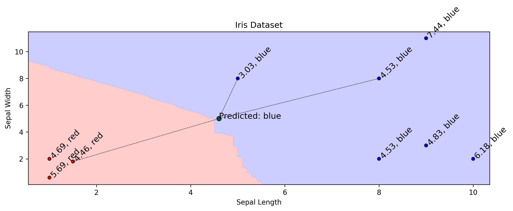

# Machine Learning

This repository contains my code and solutions following along with various machine learning courses.

My goal is to learn the basics of machine learning and get a better understanding of the math behind it. My long term goal is to apply this knowledge to Geophysical problems.

My background is in Geophysics and I have a thorough understanding of Python through my hobbies and work.

## Table of Contents
<!-- 1. [Background mathematics](#background-mathematics) -->
<!-- ?. [Supervised Learning](#supervised-learning) -->
<!-- ?. [Unsupervised Learning](#unsupervised-learning) -->
[ML from Scratch](#ml-from-scratch)

## ML from Scratch

Following along with this [YouTube playlist](https://www.youtube.com/watch?v=ngLyX54e1LU&list=PLqnslRFeH2Upcrywf-u2etjdxxkL8nl7E&index=1) by [Patrick Loeber](https://www.youtube.com/@patloeber).

### KNN (K-Nearest Neighbours)
KNN is a simple algorithm that classifies a point based on the majority of its neighbours. The algorithm is as follows:
1. Calculate the distance between the point and all other points in the dataset.
2. Sort the distances and determine the `k` nearest neighbours based on the `k` nearest distances.
3. Determine the majority of the neighbours and classify the point as that class.

The distance between two points can be calculated using the Euclidean distance formula:

$d = \sqrt{(x_2 - x_1)^2 + (y_2 - y_1)^2}$

Or for a point in `n` dimensions:
$d = \sqrt{\sum_{i=1}^{n} (x_i - y_i)^2}$

An example plot of how this prediction works is shown below. The green point is the point we are trying to classify. The blue and red points are the training data. In this case, `k = 3` and the majority of the nearest neighbors are blue, so the point is classified as blue (notably, if it was 0.1 over to the left it would classify as red due to the spike in nearest neighbours).

